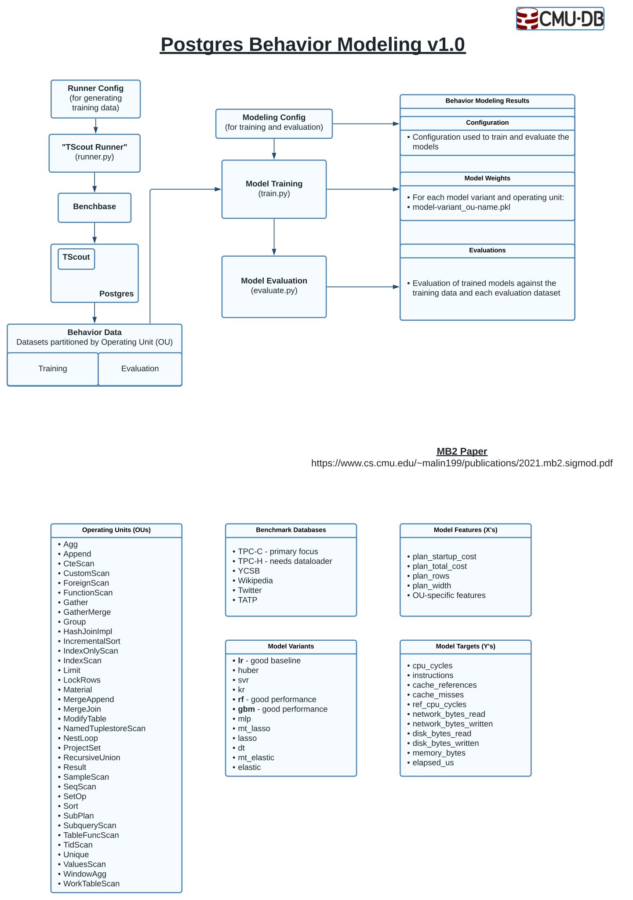

# Behavior Modeling

This document details the core components of behavior modeling and how to use them.

# Diagram 

This diagram details the general workflow.



## TScout Runner

- Runs TScout over benchbase, optionally with SQLSmith.
- Configuration in `behavior_modeling/config/tscout/.

## Training Data

- Separated into training and evaluation data in `behavior_modeling/data/train` and `behavior_modeling/data/evaluate`
- This is done because it makes data management simpler, and we can always easily add more training data.
- The alternative is to have the data stored jointly and maintain indexes or nested directories partitioning training and evaluation data.  This is typically only worth doing if training data is scarce and expensive because it allows for more flexible experimentation with minimal data.  This isn't a concern here, so we fully separate train and evaluation datasets.  This also avoids issues of intra-run data leakage; i.e. the data within a given round not being I.I.D.


## Training (`train.py`)

Trains and serializes models
#### Model Data
- model_name is model variant and training timestamp

```
model_name/ 
    <model_name>.pkl # serialized model
    <model_name>.json # model metadata
    evaluations/ # model evaluations on train/test data
```

#### Model Metadata
- Model name - just a timestamp and model variant
- Training data experiment name

## Evaluation (`evaluate.py`)

Evaluation runs inference on labeled data then computes and serializes performance metrics.

```
evaluate(model, eval_dataset)
Creates a new evaluation for <model, eval_dataset> pair.  Overwrites any existing such evaluation.
```

## Inference (`inference.py`)

Inference runs on unlabeled data and serializes results.

```
inference(model, X)
TODO: flesh this out
```
